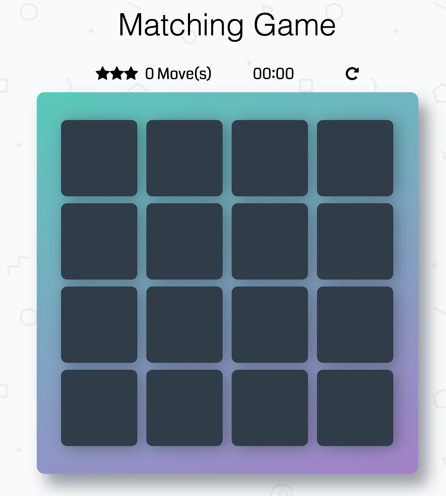

# Memory Game Project

Memory Game

### How to play

- Game URL: https://yancongli.github.io/MemoryGame/index.html
- click one box to open the card.
- If two filped card are the same, they will remain filped.
- Try to match all pairs in as minimum moves as possible.

### Screenshots

### External libraries Used

## Contributing

For details, check out [CONTRIBUTING.md](CONTRIBUTING.md).
